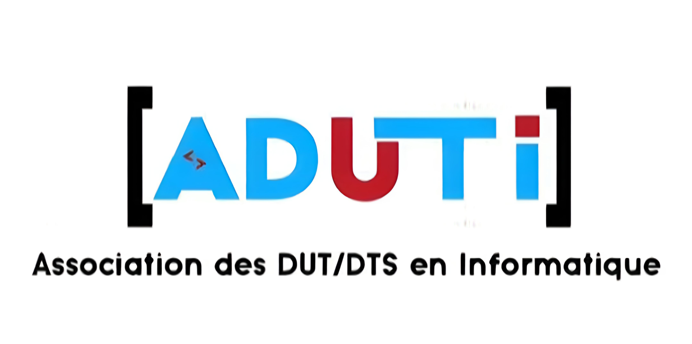

# ADUTI — Plateforme Officielle de l'Association des Informaticiens INP-HB



**ADUTI** (Association des DUT et DTS en Informatique) est la plateforme numérique officielle des étudiants et alumni en informatique de l'Institut National Polytechnique Félix Houphouët-Boigny (INP-HB) de Yamoussoukro, Côte d'Ivoire. 

Conçue avec des standards professionnels, cette application web premium centralise la gestion communautaire, met en valeur les profils de nos membres et facilite l'administration de l'association.

---

## ✨ Fonctionnalités Principales

- **🎩 Espace Annuaire Premium** : Des profils membres publics au design moderne (Glassmorphism, animations fluides) mettant en valeur les compétences et parcours (étudiants et alumni).
- **🔐 Authentification & Sécurité** : Connexion sécurisée gérée par Supabase Auth avec une séparation pointue des rôles.
- **🎛️ Tableaux de Bord Administratifs** : 
  - *Super Admin* : Gestion complète des membres, assignation des rôles critiques et des bureaux.
  - *Admin* : Modération, requêtes et gestion des activités.
  - *Bureau* : Membres avec fonction "Gestion des activités" pour piloter la vie associative.
- **📱 Responsive Design 100%** : Une expérience utilisateur optimale sur desktop, tablette et mobile, incluant des navigations par tiroirs (Framer Motion) adaptées aux petits écrans.
- **🔎 Recherche & Filtrage Avancés** : Base de données performante permettant de trouver rapidement des profils spécifiques.

---

## 🛠️ Stack Technologique

Notre application repose sur une architecture moderne, robuste et scalable :

### Frontend
- **Framework** : [Next.js 15+ (App Router)](https://nextjs.org/)
- **UI & Style** : [Tailwind CSS](https://tailwindcss.com/) / [shadcn/ui](https://ui.shadcn.com/)
- **Animations** : [Framer Motion](https://www.framer.com/motion/)
- **Icônes** : [Lucide React](https://lucide.dev/) / Google Material Icons
- **Langage** : [TypeScript](https://www.typescriptlang.org/) (Typage strict de bout en bout)

### Backend & Database
- **BaaS** : [Supabase](https://supabase.com/) (PostgreSQL, Auth, Storage)
- **ORM** : [Prisma](https://www.prisma.io/) (Gestion des schémas et requêtes)
- **Déploiement CI/CD** : Intégration GitHub Actions automatisée (déploiement webhooks Coolify)

---

## 🚀 Installation & Développement

L'environnement de développement est strict et nécessite l'utilisation exclusive de **pnpm**.

### 1. Prérequis
- Node.js (v18+)
- pnpm (Gestionnaire de paquets)
- Une base de données Supabase (PostgreSQL)

### 2. Variables d'Environnement
Copiez le fichier d'exemple et configurez vos clés :
```bash
cp .env.example .env.local
```
*(Assurez-vous de renseigner les clés Supabase URL, Service Key et les URLs publiques).*

### 3. Installation et Lancement
```bash
# Installation des dépendances avec pnpm
pnpm install

# Génération des types Prisma
npx prisma generate

# Lancement du serveur de développement (http://localhost:3000)
pnpm run dev
```

---

## 📜 Règles du Projet & Vibes

Afin de maintenir une qualité de code professionnelle et unie :
- 👉 [AI_RULES.md](./AI_RULES.md) : Conventions de nommage et standards d'architecture.
- 👉 [UI_GUIDELINES.md](./UI_GUIDELINES.md) : Règles d'esthétique, palettes de couleurs (Bleu ADUTI, animations fluides).
- 👉 [DATABASE_SCHEMA.md](./DATABASE_SCHEMA.md) : Mapping de la base de données relationnelle.
- 👉 [BUSINESS_RULES.md](./BUSINESS_RULES.md) : Logiques d'accès et de rôles.

---

## 📫 Contact & Réseaux

Rejoignez la communauté ADUTI et suivez nos activités :

- 💼 **LinkedIn** : [ADUTI INP-HB](https://www.linkedin.com/company/association-des-dut-et-dts-en-informatique-de-l-inp-hb-aduti/)
- 📸 **Instagram** : [@aduticsi](https://www.instagram.com/aduticsi?igsh=enF6ejl5bzY3bm1n)
- 🌐 **Facebook** : [Notre Page](https://www.facebook.com/share/1ERtvdnwfR/)
- 📧 **Email** : [csiaduti@gmail.com](mailto:csiaduti@gmail.com)
- 📞 **Téléphone** : +225 0706548994 / +225 0788103388

<div align="center">
  <p><i>Fait avec excellence pour la communauté informatique de l'INP-HB.</i></p>
</div>